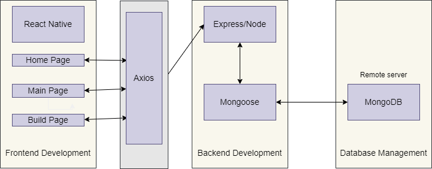
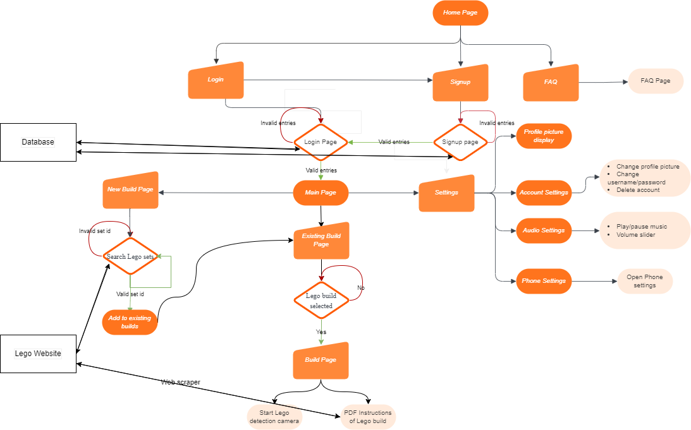

# Orbital-TSS

README (caa 25 June 2023)

### Project Aim:

The aim of our orbital project is to develop a comprehensive mobile application for Lego enthusiasts, offering a range of features including model recognition, build planning, personal Lego set database, and access to official Lego building instructions. The goal is to provide a one-stop tool that facilitates and enhances the Lego building experience for users.

### Project Description:

The first feature is the model recognition capability. Users can capture lego pieces through their phone camera. With the object detection model, the app can identify the Lego pieces, providing information such as piece names, quantities, and colors.

The second feature is the build planner. Users can select an existing Lego set tied to their account from the database. The app then provides step-by-step instructions sourced from official Lego building instructions or community-generated techniques. Users can then follow the guided instructions when building their lego sets. This feature assists users in planning and executing their builds efficiently.

The app also includes a personal Lego set database, allowing users to create and manage their Lego collections. Users can manually add sets they own, along with details such as set number, name, theme, and release year. This feature provides a convenient overview of their Lego collection, enabling effective management and organization.

### Structure

Our folders are organised as per the following:

    .
    ├── src
        ├── client                   # Source folders for React Native app
            ├── App.tsx              # Main folder
            ├── Assets
            ├── data
            ├── Frontend
            └── Backend
        └── server                   # Local server to communicate with MongoDB
            ├── routes
            ├── models
            └── controllers
    └── index.js

### High-Level Overview

### Logic Flow Diagram

### User stories

Our product should enable the user of the mobile application to:

1. Create a personalized profile within the mobile application, so that users can keep track of their Lego data and have a personalized experience.
2. Add Lego sets to their collection within the mobile application, including details such as set number, name, theme, and year of release, to easily keep track of Lego sets.
3. Access a visual development guide or step-by-step instructions for building a Lego model within the mobile application.
4. Search for specific Lego pieces with the camera app, to locate the exact piece required for the build without hassle.

### Description of Key Features

1. Login system\
   On the Home Screen, the user first clicks on the “Signup” button which navigates the user to the SignupPage. There, the user enters his username and password. When “Create Account” is pressed, a POST request containing the user’s details is sent over and stored inside the MongoDB database. This entry then belongs to the user. When the user adds in lego sets to his collection, this information is stored in the same entry in the database and can be accessed by the user whenever he logs back in.

2. Searching function\
   Each lego set comes with a unique ID. In the NewBuildPage, the user searches for lego sets by their lego set ID. The system sends a GET request to the Rebrickable lego sets API which fetches back the array containing the details of the lego set. This information is rendered on the screen in the form of a Touchable component. The user selects this component, and creates this build, adding the lego set into the database. The build will now appear in the existing build page. Upon rendering of the page, it makes a POST request to obtain the array of sets tied to the user, and renders it on the screen.

3. Build Planner\
   In our BuildPage, the PDF consisting the building instructions for the chosen Lego set is rendered. At the bottom half of the screen is a Camera Component which allows the user to take a snapshot of the pile of Legos. The object detection algorithm undergoes a filtering process to highlight only the relevant Lego blocks required for the current building step.

4. Object Detection for different Lego pieces\
   Our computer vision model trained on a lego dataset is able to identify different lego pieces with relatively high confidence. When the user hovers his camera over a mess of legos, the detection model draws bounding boxes around the lego pieces identified, with a label stating the type of lego piece detected.

### Tech stack:

- MongoDB, Express, React-native, Node (MERN)
- Python, OpenCV, PyTorch

### Challenges faced

1. Steep Learning Curve\
   Starting off the project with so many frameworks in mind was daunting at times. We took a while to familiarise with the frameworks and began building our project in baby steps, making sure to stay organised along the way.

2. Package Version Control\
   It was difficult to track the versions of the packages that both of us had. Some packages were only compatible with specific versions of other packages. Moreover, collaboration became a greater issue when some packages worked for one of us but not the other.

3. Lego Dataset Curation\
   Lego pieces come in several shapes, sizes and colour. Creating a good lego dataset that is fully representative of all lego types is tough to accomplish given the short duration of time. We had to weigh our options and focused on an idea which minimised labour costs.

4. Integrating Computer Vision model with real-time object detection\
   We intially had the idea of having our Computer Vision model detect and identify the appropriate pieces to the builder in real-time. After much experimenting and research, we found that the react-native CLI had little support for such an integration. We always either had package management issues with the new packages, or had a seemingly workable package which soon turned out to only support Expo development. As a result, we decided to remove the element of real-time object detection, and instead send the image data captured by the camera to the cloud where the Computer Vision model is hosted.

### Features implemented in Milestone #2

1. Enhancing accuracy and reliability of computer vision model\
   Corrected the bug where computer vision model had inconsistent labelling. Modified training dataset to include more instances of lego models stacked together, making the dataset more representative of a real-world scenario.
2. Enhancing account management capabilities\
   New features allowed user to enter only a unique username during account creation. User can modify account settings such as properly adding and removing builds.
3. Setting up of remote server\
   Deployment of server to a free remote host for easier testing rather than on local.
4. Developing lego website scraper\
   Web scraper is used to obtain the PDF instructions of how to build the lego sets.
5. Integrate PDF component to app\
   Add in PDF reader components to the app.
6. Enhancing account login security\
   To prevent developers with DB access to read other people's login details.
7. Integrating camera component into the Build Planner\
   Adding of Camera into app.
8. Improve user experience with changing user settings\
   Function to change username and password. User able to rotate screen based on their preference.
9. Integrating music player\
   Allows users to play, pause and adjust the volume of background music.
10. Integrating Lego object detection capabilities\
    Camera component sends the image data captured by the camera to the cloud where the Computer Vision model is hosted. Then, the new image data is sent back to the phone and rendered.

### Plans for the next Milestone

1. Gather more user feedback and make changes accordingly
2. Give the app proper styling with Lego-based components to make the Lego building experience more immersive
3. Improve the accuracy and reliability of the Computer Vision model

### Other Computer Vision files

1. Google Colab file for training the Computer Vision model:
   https://colab.research.google.com/drive/13N1VZw_mJV1Wm0FindNM-Rhuo3h9hCGE?usp=sharing
2. Dataset we created for use in this project:
   https://drive.google.com/file/d/1EH3BdwHm854lhS5HibI8mEHLN_YeE5s2/view?usp=sharing

### Instructions to run the project

1. Download this APK file on an Android device. \
   https://drive.google.com/drive/folders/1MHNi03Pa6CElFJfwn4J6-Pfsvk49woRm?usp=sharing
2. Do enable permissions to download this unknown file from android.
3. Logging in as a new or existing user: \
   Signup for a new account and login. (If it takes a while, do wait a few minutes as the server we're hosting with needs time to start once the first request comes in :'> )
4. Creating a new build based on Lego ID: \
   Enter the 'New Build' tab and search for any Lego set based on their ID. Here are some Lego IDs to try out: 76258, 10323, 21057. Press the build to select, then press 'Create Build!' to enter the Existing Build Page.
5. Select the desired build from the list of existing builds: \
   Press onto the build you want to work on and press 'Let's start building!' to enter the Build page.
6. Navigating the Build Page: \
   You can browse the PDF at the top half of the screen. When required, open the camera and take a photo of the pile of Lego bricks in front of you by pressing the white circle button. Our model will return an image with appended bounding boxes, showing you the Lego pieces required at this page of the PDF.
